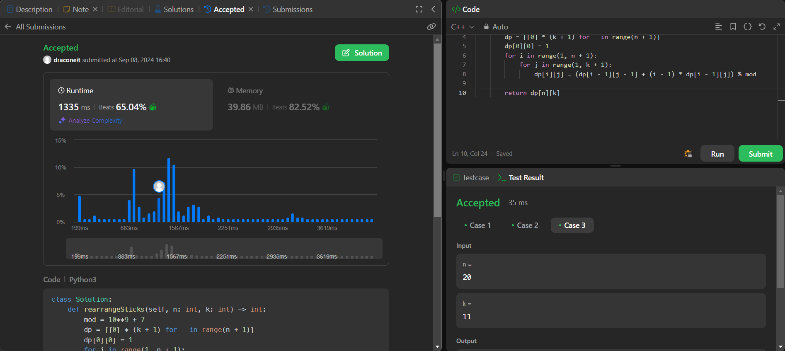

# Exercícios LeetCode

**Número da Lista**: 5<br>
**Conteúdo da Disciplina**: Programação Dinâmica<br>
 
## Alunos
|Matrícula | Aluno |
| -- | -- |
| 19/0030801  | João Pedro Costa |
| 20/2028973  | Tiago Albuquerque de Lima |

## Sobre 
Este repositório tem como objetivo a resolução de exercícios sobre programação dinâmica do [LeetCode](https://leetcode.com/), utilizando o conteúdo do quinto módulo Programação Dinâmica.

## Screenshots
### Exercício 1 - [Number of Ways to Rearrange Sticks With K Sticks Visible](https://leetcode.com/problems/number-of-ways-to-rearrange-sticks-with-k-sticks-visible/)

Dificuldade: Difícil<br>
Problema: [Number of Ways to Rearrange Sticks With K Sticks Visible](Number_of_Ways_to_Rearrange_Sticks_With_K_Sticks_Visible/Number_of_Ways_to_Rearrange_Sticks_With_K_Sticks_Visible.md)<br>
Codigo: [Solução](Number_of_Ways_to_Rearrange_Sticks_With_K_Sticks_Visible/Number_of_Ways_to_Rearrange_Sticks_With_K_Sticks_Visible.py)<br>



### Exercício 2 - [NOME DO PROBLEMA](link do leet do problema)

Dificuldade: Difícil<br>
Problema: [NOME DO PROBLEMA](link da descrição do problema)<br>
Codigo: [Solução](link da solução)<br>


### Exercício 3 - [Minimum Number of Coins for Fruits](https://leetcode.com/problems/minimum-number-of-coins-for-fruits/)

Dificuldade: Médio<br>
Problema: [Minimum Number of Coins for Fruits](Minimum_Number_of_Coins_for_Fruits/Minimum_Number_of_Coins_for_Fruits.md)<br>
Codigo: [Solução](link da solução)<br>


## Instalação 
**Linguagem**: Python<br>
- O codigo deve ser executado no site do LeetCode em uma classe Solution.

## Uso 
- 1°: Copiar o codigo do arquivo ```.py```.
 
- 2°: Entrar no site do LeetCode.
 
- 3°: Criar uma conta no LeetCode.
 
- 4°: Entrar no link dos exercicios.
 
- 5°: Alterar a linguagem para ```Python3```.
 
- 6°: Colar o codigo no painel.
 
- 7°: Clicar em ```Run```.
 
- 8°: Obter e Verificar resultado dos codigos.

**Obs.:** Faça isso para cada codigo.

## Outros 
**Apresentação da resolução dos exercícios:**
